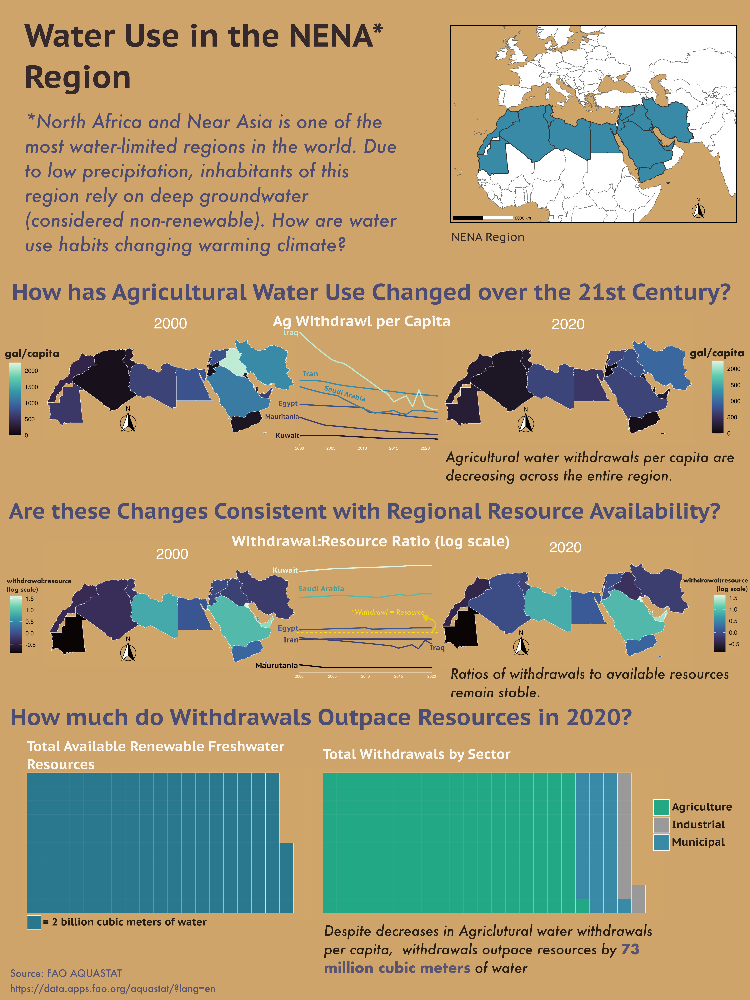

# EDS240 Infographic - Water Use, Scarcity and Remediation

## Purpose
This project investigates trends in water scarcity across the Near East and North Africa (NENA) region using data from the Food and Agriculture Organization’s FAO AQUASTAT. The goal of the analysis is to explore how water withdrawals—particularly for agriculture—have changed from 2000 to 2020 and how these withdrawals compare to the region’s available renewable freshwater resources.
The results of this analysis are synthesized into an infographic designed to communicate regional trends in agricultural water use and water stress to a broad audience. This repository contains the data processing workflow, visualization code, and supporting materials used to produce figures featured in the final infographic.



## Contents

This repo contains the necessary script and data to produce all figures used in the final infographic. The final graphic was arranged and completed in Affinity.

```
├── data # Contains FAO Aquastat and Country shapefile data
│   ├── aquastat_nena.csv
│   └── countries
│       ├── ne_50m_admin_0_countries.cpg
│       ├── ne_50m_admin_0_countries.dbf
│       ├── ne_50m_admin_0_countries.prj
│       ├── ne_50m_admin_0_countries.README.html
│       ├── ne_50m_admin_0_countries.shp
│       ├── ne_50m_admin_0_countries.shx
│       └── ne_50m_admin_0_countries.VERSION.txt
├── exploration_scripts # Old scripts, can be ignored
├── infographic_blog_post.html # Final render of blog post
├── infographic_blog_post.qmd # Contains final blog post, which harbors all code used to create figures
└── README.md

```
## Data Access

Data is located in this repository. Citations for data sources are included below.

## Citations

##### Water use
Food and Agriculture Organization of the United Nations (FAO). (n.d.). AQUASTAT: FAO’s global information system on water and agriculture. Retrieved January 15, 2026, from https://data.apps.fao.org/aquastat/?lang=en

##### Precipitation
The World Bank. (n.d.). Average precipitation in depth (mm per year). World Bank Open Data. Retrieved January 15, 2026, from https://data.worldbank.org/indicator/AG.LND.PRCP.MM


## Author
Henry Oliver - Bren School for Environmental Science and Management


