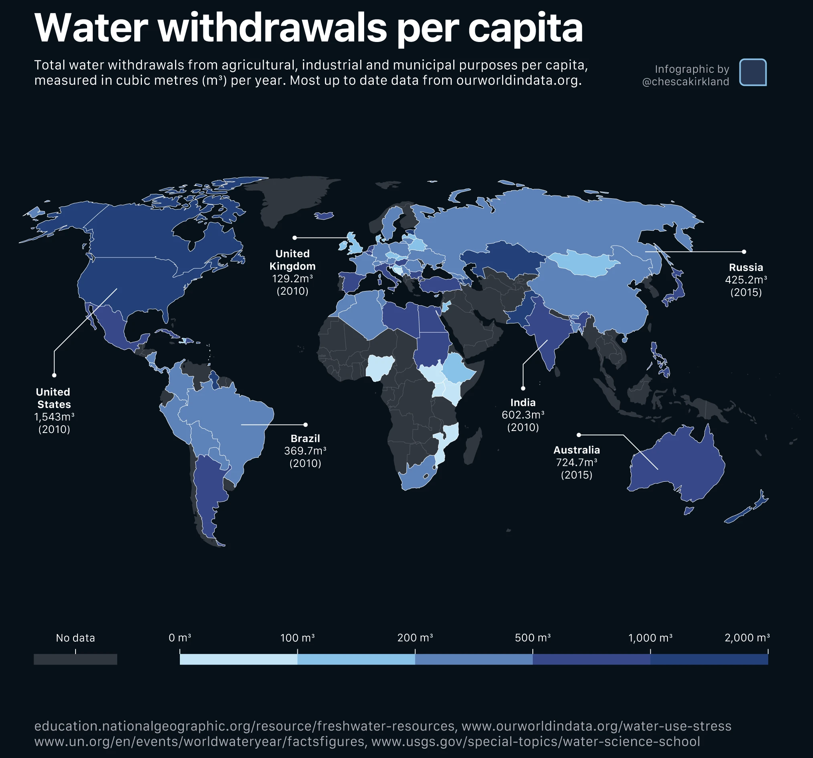
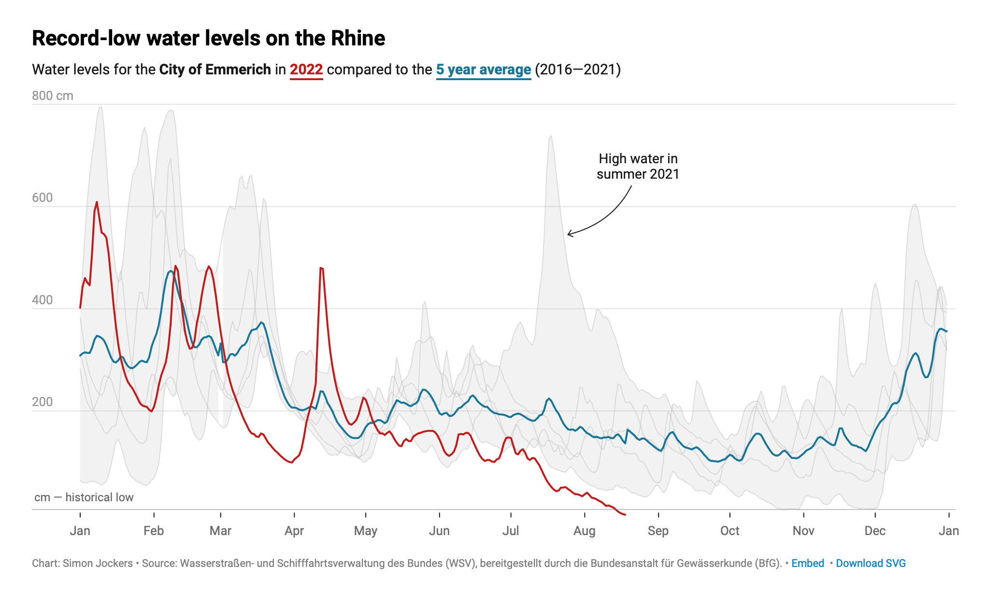
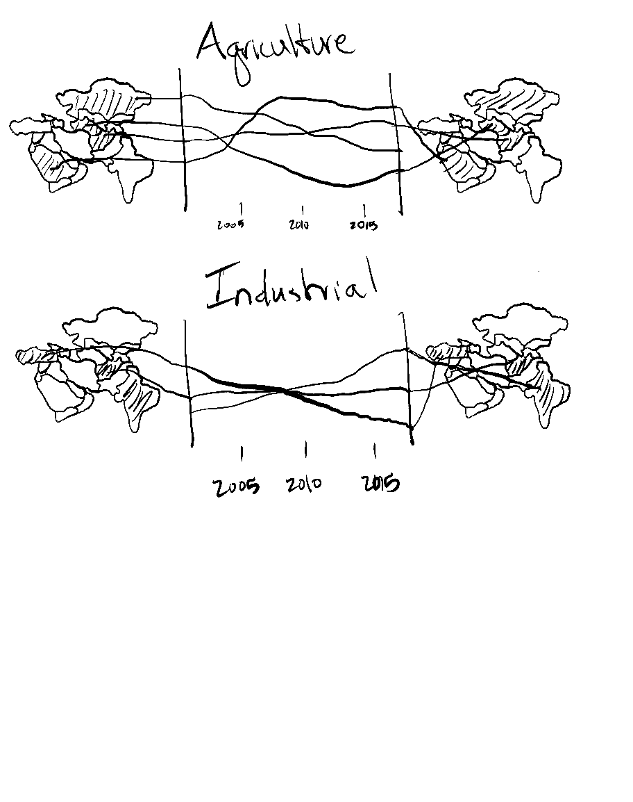

### III: Pre-planning
*Restate the questions you hope to answer with your infographic. This should include one overarching question and at least three subquestions. Have these questions changed at all since FPM #1? If yes, how so?*

#### 1)
How has water use in different sectors changed in the Middle East over the last 20 years?
    
    What countries use the most water per capita for agriculture?
    What countries use the most water per capita for industry and municipal water?
    How have use patterns in these countries changed over the last 20 years?
    

Since my initial FPM - I have narrowed the geographic and temporal scope of my analysis. I have also stopped looking for datasets on different water policies. 


#### 2)
Explain which variables from your data set(s) you will use to answer the above questions, and how.

agricultural water withdrawal
long-term average precipitation
population
agricultural water withdrawal per capita
industrial water withdrawal per capita
municipal water withdrawal per capita


I will determine the most water stressed countries by comparing the agricultural withdrawals to cumulative precipitation. Then I will compare time series of water withdrawals per capita per sector between these countries.


#### 3) Example visualizations

I intend on using a similar format to plot water withdrawal per capita for areas of this map that have not been included. Primarily countries in the middle east. I may also use similar labeling strategies once I move in to affinity.




I like how the lines for 2022 and the five year average are given emphasis in this figure. I haven't done so yet - but I would like to use a similar strategy to draw attention to particular countries of interest in my figure. I might also use colored text instead of a legend in my line graph.


### IV: Hand Drawn Visualizations




```{r}
suppressPackageStartupMessages({
  library(here)
  library(tidyverse)
  library(janitor)
})

```

```{r}
water <- read_csv(here("data/aquastat_asia.csv"), show_col_types = FALSE) %>% 
  clean_names()

my_tan <- "#D6B588"
```

```{r}
# Pivot data wider to get variables out of "variable" column and into their own
water_wider <- water %>% 
  pivot_wider(names_from = variable, values_from = value,
              id_cols = c(area, year)) %>% 
  clean_names()

```

```{r}
# 8 countries with highest (withdrawal for agriculture):(precipitation) ratio for 2020
top_countries <- water_wider %>%
  filter(year == 2020) %>% # Top 10 in 2020
  # Create 'stress_ratio' column. Contains ratio of ag withdrawal / precipitation
  mutate(stress_ratio = agricultural_water_withdrawal / long_term_average_annual_precipitation_in_volume) %>%
  slice_max(stress_ratio, n = 8) %>% # Top 8 Countries
  pull(area)
```

```{r}

```


```{r}
#| eval: false
library(scales)

plot2_pro <- water_wider %>%
  filter(area %in% top_countries) %>% 
  mutate(stress_ratio = agricultural_water_withdrawal / long_term_average_annual_precipitation_in_volume) %>%
  ggplot(aes(x = stress_ratio, color = factor(year))) +
  # Use a slightly thicker line (linewidth) for better color visibility
  geom_density(linewidth = 1, alpha = 0.8) +
  
  # Professional Scales
  scale_x_log10(labels = scales::label_comma()) +
  scale_color_viridis_d(option = "mako", begin = 0.9, end = 0.3) +
  
  # Clear and descriptive labels
  labs(
    title = "Agricultural Water Stress Over Time in Arid Regions",
    subtitle = "Distribution of the ratio between agricultural withdrawal and annual precipitation\nin top 10 countries with most water stress",
    x = "Ag Withdrawal / Precipitation (Log Scale)",
    y = "Density",
    color = "Year",
    caption = "Source: AQUASTAT Database"
  ) +
  
  # The "Professional" Theme Adjustments
  theme_minimal() +
  theme(
    # 1. Remove vertical grid lines (cleaner look)
    panel.grid.minor = element_blank(),
    panel.grid.major.x = element_blank(),
    
    # 2. Lighten horizontal grid lines so they don't compete with the data
    panel.grid.major.y = element_line(color = "grey92"),
    
    # 3. Anchor the plot with a solid X-axis line
    axis.line.x = element_line(color = "black", linewidth = 0.5),
    
    # 4. Refine Text Hierarchy
    plot.title = element_text(face = "bold", size = 16),
    plot.subtitle = element_text(size = 11, color = "grey40", margin = margin(b = 15)),
    plot.caption = element_text(size = 8, color = "grey60", hjust = 0),
    
    # 5. Legend placement on the right
    legend.position = "right",
    legend.title = element_text(face = "bold"),
    
    # 6. Add some breathing room
    plot.margin = margin(20, 20, 20, 20)
  )

plot2_pro
```


```{r}
# Create plot showing global trends in sources of water stress
plot4 <- water_wider %>%
  filter(area %in% top_countries) %>% 
  group_by(year) %>%
  # Calculate averages of water stress source per year
  summarise(avg_ag = mean(sdg_6_4_2_agricultural_sector_contribution_to_water_stress, na.rm = TRUE),
            avg_municipal = mean(sdg_6_4_2_municipal_sector_contribution_to_water_stress, na.rm = TRUE),
            avg_industrial = mean(sdg_6_4_2_industrial_sector_contribution_to_water_stress, na.rm = TRUE)) %>%
  pivot_longer(cols = c(avg_ag, avg_municipal, avg_industrial),
               names_to = "sector", 
               values_to = "stress") %>%
  ggplot(aes(x = year, y = stress, fill = sector)) +
  geom_area() +
  scale_fill_manual(values = c("avg_ag" = "#6fae72", 
                                "avg_municipal" = "#23babd", 
                                "avg_industrial" = "#494949")) +
  labs(y = "Average Water Stress", fill = "Sector",
       title = "Global Water Stress by Sector") +
  theme_minimal()
```


```{r}
#| include: False


library(sf)

world <- st_read(here("data/countries/ne_50m_admin_0_countries.shp")) %>% 
  clean_names()
asia <- world[world$continent == "Asia", ] %>% 
  select("admin", "geometry")
```

```{r}
#| echo: False
#| include: False

water_wider$area[water_wider$area == "Türkiye"] <- "Turkey"
water_wider$area[water_wider$area == "Iran (Islamic Republic of)"] <- "Iran"
water_wider$area[water_wider$area == "Syrian Arab Republic"] <- "Syria"
unique(water_wider$area)


```

```{r}
#| echo: False
#| hide: True
#| include: False
setdiff(water_wider$area, asia$admin)

setdiff(asia$admin, water_wider$area)
```

```{r}
#| hide: True
#| echo: False
#| include: False
common_countries <- intersect(water_wider$area, asia$admin)

asia_clean <- asia %>%
  filter(admin %in% common_countries)

water_clean <- water_wider %>%
  filter(area %in% common_countries)

asia_joined <- asia_clean %>%
  left_join(water_clean, by = c("admin" = "area"))
```


```{r}
#| include: False
ggplot(asia_joined %>% 
         filter(year=="2000")) +
  geom_sf(aes(fill = agricultural_water_withdrawal_as_percent_of_total_water_withdrawal), color = "white", size = 0.2) +
  scale_fill_viridis_c(option = "mako", direction = 1) +
  theme_minimal() +
  labs(fill = "Agricultural Contribution to water Stress")
```


```{r}
#| include: False
ggplot(asia_joined) +
  geom_sf(aes(fill = total_population), color = "white", size = 0.2) +
  scale_fill_viridis_c(option = "mako", trans = "log10") +
  theme_minimal() +
  labs(fill = "Population (log scale)")
```
```{r}
library(ggspatial)

ag_2000 <- ggplot(asia_joined %>% filter(year=="2000") %>% 
                    filter(admin != "Nepal") %>%
                    filter(admin != "Bangladesh") %>%
                    filter(admin != "Bhutan") %>% 
                    filter(admin != "Sri Lanka") %>% 
                    filter(admin != "Turkmenistan")) +
  geom_sf(aes(fill = agricultural_water_withdrawal_per_capita), color = "white", size = 0.2) +
  scale_fill_viridis_c(option = "mako", direction = 1, limits = c(0, 3000),
                       guide = guide_colorbar(direction = "vertical", title.position = "top")) +
  annotation_north_arrow(location = "tr", which_north = "true",
                         style = north_arrow_fancy_orienteering()) +
  theme_minimal() +
  theme(
    panel.grid = element_blank(),
    panel.background = element_rect(fill = my_tan, color = NA),
    plot.background = element_rect(fill = my_tan, color = NA),
    legend.position = "left",
    legend.key.height = unit(1.5, "cm"),
    legend.title.position = "top",
    legend.title = element_text(hjust = 0.5),
    axis.text = element_blank(),
    axis.title = element_blank(),
    plot.title = element_text(hjust = 0.5, color = "white", size = 24)
  ) +
  labs(fill = "Agricultural Water\nWithdrawal Per Capita", title = "2000")

ag_2000
```


```{r}
labels_end <- asia_joined %>%
  #filter(admin %in% top_countries, year >= 2000, year <= 2020) %>%
  group_by(admin) %>%
  filter(!is.na(agricultural_water_withdrawal_per_capita)) %>%
  slice_max(year, n = 1)

labels_start <- asia_joined %>%
 # filter(admin %in% top_countries, year >= 2000, year <= 2020) %>%
  group_by(admin) %>%
  filter(!is.na(agricultural_water_withdrawal_per_capita)) %>%
  slice_min(year, n = 1)

ag_trend <- asia_joined %>%
  # filter(admin %in% top_countries) %>%
  filter(year >= 2000 & year <= 2022) %>%
  ggplot(aes(x = year, y = agricultural_water_withdrawal_per_capita, color = admin)) +
  geom_line(linewidth = 2) +
  geom_text(data = labels_end,
            aes(label = round(agricultural_water_withdrawal_per_capita, 1)),
            hjust = -0.2, size = 3.5, show.legend = FALSE) +
  geom_text(data = labels_start,
            aes(label = round(agricultural_water_withdrawal_per_capita, 1)),
            hjust = 1.2, size = 3.5, show.legend = FALSE) +
  scale_color_viridis_d(option = "mako") +
  scale_x_continuous(expand = expansion(mult = c(0.1, 0.1))) +
  theme_minimal() +
 theme(
    panel.grid.minor = element_blank(),
    panel.grid.major = element_blank(),
    panel.background = element_rect(fill = my_tan, color = NA),
    plot.background = element_rect(fill = my_tan, color = NA),
    axis.text.y = element_blank(),
    axis.ticks.y = element_blank(),
    axis.text.x = element_text(color = "white", size = 14),
    axis.ticks.x = element_line(color = "white"),
    axis.line.x = element_blank(),
    legend.position = "none"
  ) +
  labs(x = NULL, y = NULL, color = NULL)

ag_trend
```

```{r}
library(ggspatial)

ag_2020 <- ggplot(asia_joined %>% 
         filter(year=="2020") %>% 
         filter(admin != "Nepal") %>% 
         filter(admin != "Bangladesh") %>% 
         filter(admin != "Bhutan") %>% 
         filter(admin != "Sri Lanka") %>% 
         filter(admin != "Turkmenistan")) +
  geom_sf(aes(fill = agricultural_water_withdrawal_per_capita),
          color = "white",
          size = 0.2) +
  scale_fill_viridis_c(option = "mako", direction = 1, limits = c(0, 3000),
                       guide = guide_colorbar(direction = "vertical", title.position = "top")) +
  annotation_north_arrow(location = "tr", which_north = "true",
                         style = north_arrow_fancy_orienteering()) +
  theme_minimal() +
  theme(
    panel.grid = element_blank(),
    panel.background = element_rect(fill = my_tan, color = NA),
    plot.background = element_rect(fill = my_tan, color = NA),
    legend.position = "right",
    legend.key.height = unit(1.5, "cm"),
    legend.title.position = "top",
    legend.title = element_text(hjust = 0.5),
    axis.text = element_blank(),
    axis.title = element_blank(),
    plot.title = element_text(hjust = 0.5, color = "white", size = 24)
  ) +
  labs(fill = "Agricultural Water\nWithdrawal Per Capita",
       title = "2020")
ag_2020
```

```{r}
ind_2000 <- ggplot(asia_joined %>% 
         filter(year=="2000") %>% 
         filter(admin != "Nepal") %>% 
         filter(admin != "Bangladesh") %>% 
         filter(admin != "Bhutan") %>% 
         filter(admin != "Sri Lanka")) +
  geom_sf(aes(fill = industrial_water_withdrawal_per_capita), color = "white", size = 0.2) +
  scale_fill_viridis_c(option = "mako", direction = 1) +
  annotation_north_arrow(location = "tr", which_north = "true",
                         style = north_arrow_fancy_orienteering()) +
  theme_minimal() +
  theme(
    panel.grid = element_blank(),
    panel.background = element_rect(fill = my_tan, color = NA),
    plot.background = element_rect(fill = my_tan, color = NA),
    legend.position = "bottom",
    legend.key.width = unit(2, "cm"),
    legend.title.position = "bottom",
    legend.title = element_text(hjust = 0.5),
    axis.text = element_blank(),
    axis.title = element_blank(),
    plot.title = element_text(hjust = 0.5, color = "white", size = 24)
  ) +
  labs(fill = "Industrial Water Withdrawal Per Capita",
       title = "2000")

ind_2000

```
```{r}
labels_end <- asia_joined %>%
  filter(admin %in% top_countries, year >= 2000, year <= 2022) %>%
  group_by(admin) %>%
  filter(!is.na(industrial_water_withdrawal_per_capita)) %>%
  slice_max(year, n = 1)

labels_start <- asia_joined %>%
  filter(admin %in% top_countries, year >= 2000, year <= 2022) %>%
  group_by(admin) %>%
  filter(!is.na(industrial_water_withdrawal_per_capita)) %>%
  slice_min(year, n = 1)

ind_trend <- asia_joined %>%
  filter(admin %in% top_countries) %>%
  filter(year >= 2000 & year <= 2022) %>%
  ggplot(aes(x = year, y = industrial_water_withdrawal_per_capita, color = admin)) +
  geom_line(linewidth = 2) +
  geom_text(data = labels_end,
            aes(label = round(industrial_water_withdrawal_per_capita, 1)),
            hjust = -0.2, size = 3.5, show.legend = FALSE) +
  geom_text(data = labels_start,
            aes(label = round(industrial_water_withdrawal_per_capita, 1)),
            hjust = 1.2, size = 3.5, show.legend = FALSE) +
  scale_color_viridis_d(option = "mako") +
  scale_x_continuous(expand = expansion(mult = c(0.1, 0.1))) +
  theme_minimal() +
 theme(
    panel.grid.minor = element_blank(),
    panel.grid.major = element_blank(),
    panel.background = element_rect(fill = my_tan, color = NA),
    plot.background = element_rect(fill = my_tan, color = NA),
    axis.text.y = element_blank(),
    axis.ticks.y = element_blank(),
    axis.text.x = element_text(color = "white", size = 14),
    axis.ticks.x = element_line(color = "white"),
    axis.line.x = element_blank(),
    legend.position = "none"
  ) +
  labs(x = NULL, y = NULL, color = NULL)

ind_trend
```


```{r}
ind_2020 <- ggplot(asia_joined %>% 
         filter(year=="2020") %>% 
         filter(admin != "Nepal") %>% 
         filter(admin != "Bangladesh") %>% 
         filter(admin != "Bhutan") %>% 
         filter(admin != "Sri Lanka")) +
  geom_sf(aes(fill = industrial_water_withdrawal_per_capita), color = "white", size = 0.2) +
  scale_fill_viridis_c(option = "mako", direction = 1) +
  annotation_north_arrow(location = "tr", which_north = "true",
                         style = north_arrow_fancy_orienteering()) +
  theme_minimal() +
  theme(
    panel.grid = element_blank(),
    panel.background = element_rect(fill = my_tan, color = NA),
    plot.background = element_rect(fill = my_tan, color = NA),
    legend.position = "bottom",
    legend.key.width = unit(2, "cm"),
    legend.title.position = "bottom",
    legend.title = element_text(hjust = 0.5),
    axis.text = element_blank(),
    axis.title = element_blank(),
    plot.title = element_text(hjust = 0.5, color = "white", size = 24)
  ) +
  labs(fill = "Industrial Water Withdrawal Per Capita",
       title = "2020")

ind_2020
```


### VI

1. What are the key insights you want your infographic to communicate, and how will your design choices help highlight and support those messages?

  I want my infographic to give detailed information on how our most arid and water stressed nations use water, and how that has changed in the last 20 years. Right now I'm workshopping what it would look like to use two maps and connect them with line charts. In this way I would like to emphasize geographic changes, and highlight countries that have gone through dramatic sector specific changes in the last two decades.

2. What challenges did you encounter or anticipate encountering as you continue to build / iterate on your visualizations in R? If you struggled with mocking up any of your three visualizations, describe those challenges here.

Right now I don't know how I'm going to label my countries. In my head, each line was going to come out of the map for it's respective country, change in hue as it traveled through time, and then ended up on the other map with it's new color. But I'm seeing now that this doesn't leave me much room to right country names - and I think doing the hue-changing-line-graph will be tricky in affinity.

3. What ggplot extension tools / packages do you need to use to build your visualizations? Are there any that we haven’t covered in class that you’ll be learning how to use for your visualizations?

`ggspatial`, `tidyverse`, `sf`, `viridis` - only packages that we have used in class.

4. What feedback do you need from the instructional team and / or your peers to ensure that your intended message and key insights are clear.

I'm really not sure - I'm turning this in because I spent a lot of time on it but I'm thinking about abandoning this whole idea of making maps with connecting line graphs. If there's a magic package that jumps out to the instructional team for how to have lines that exit a map in one color, then dive into another map in another color, and change hue consistently in the line graph, I would be very interested to hear about it. But I have a feeling this approach I've spent a lot of time on will just require a bunch of time in affinity, which doesn't feel like the purpose of this exercise. I've been desperately trying to avoid making a bunch of pie charts and bar graphs, but when I think about visualizing my data these really jump out as the figures that make the most sense. I'm going to continue thinking about creative ways to visualize this data - I don't think this method is my ticket!

